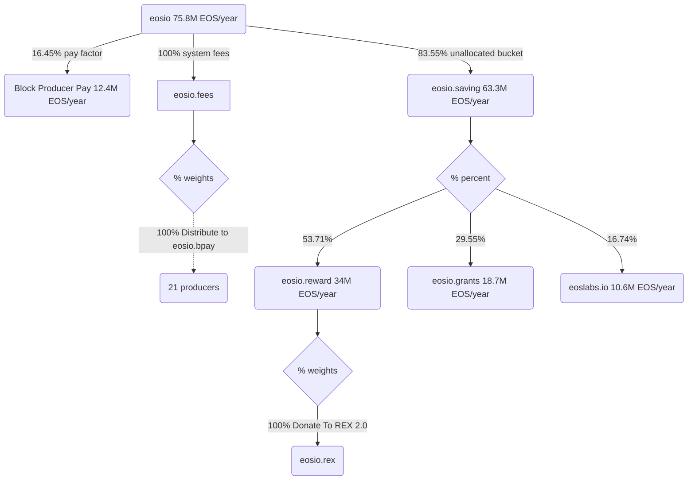
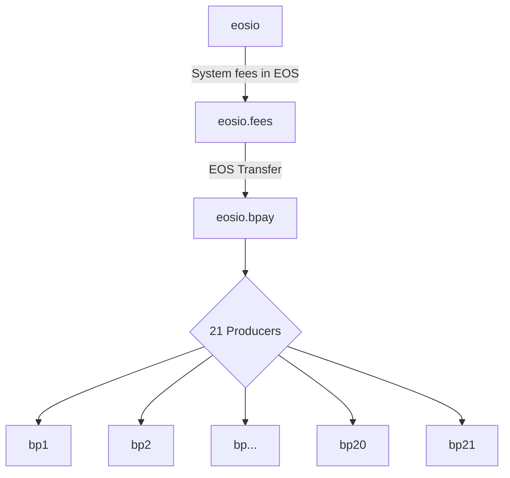

# EOS REX 2.0 Upgrade

> [v3.5.0 Release Notes](https://github.com/eosnetworkfoundation/eos-system-contracts/releases/tag/v3.5.0)

### REX 2.0 token distribution



### `eosio.bpay` token distribution

The `eosio.bpay` contract handles block production rewards accumulated through network fees.



### Allocations (Annual Rate)

| Sender | Receiver | Allocation (%)| Amount/year |
|--------|-------|------------|--------|
| eosio  |       | 100% | 75,959,037 EOS |
| eosio | eosio.saving | 83.55% | 63,300,000 EOS |
| eosio | producer pay | 16.45% | 12,400,000 EOS |
| eosio.saving | eosio.reward | 53.71% | 34,083,823 EOS |
| eosio.saving | eosio.grants | 29.55% | 18,752,131 EOS |
| eosio.saving | eoslabs.io | 16.74% | 10,623,034 EOS |

## [Build CDT](https://github.com/AntelopeIO/cdt) (`v4.0.1`)

```bash
git clone --recursive https://github.com/AntelopeIO/cdt
cd cdt
git checkout v4.0.1
mkdir build
cd build
cmake ..
make -j $(nproc)
```

## [Compile EOS System Contracts](https://github.com/eosnetworkfoundation/eos-system-contracts/releases/tag/v3.5.0-rc1
) (`v3.5.0-rc1`)

```bash
gh repo clone eosnetworkfoundation/eos-system-contracts
cd eos-system-contracts
git checkout v3.5.0-rc1
export CDT_INSTALL_DIR="<path>/cdt/build"
./build.sh
```

## [Compile EOS System Contracts](https://github.com/eosnetworkfoundation/eosio.reward/releases/tag/v1.0.0-rc1
) (`v1.0.0-rc1`)

```bash
gh repo clone eosnetworkfoundation/eosio.reward
cd eosio.reward
git checkout v1.0.0-rc1
./build.sh
```

## Contract `sha-256` checksums
```bash
$ shasum -a 256 ./build/contracts/**/*.wasm
90a0db1f7a4d1a7bccc5a5400edaa489ae685e0cd5b052de8440096139638efc  ./build/contracts/eosio.bpay/eosio.bpay.wasm
17dd9c7a7a9f39c66a97d9c7d2ef2585f51af90b2a1c44cc2fd2265c1f804a8c  ./build/contracts/eosio.fees/eosio.fees.wasm
49155e7e98991d9dad21970bb1d1cfec0d5ab77e842feaaa0dac1d1a91180cc7  ./build/contracts/eosio.reward/eosio.reward.wasm
ad12d594b75bdb4ab84c568f29d97f1ce82f50cca55a1f8a7d0406d4728d0e4b  ./build/contracts/eosio.system/eosio.system.wasm
```

```bash
$ shasum -a 256 ./build/contracts/**/*.abi
1cef6917b10be533e0ea66d794c50973f023002e608e33280277e74c79aa8dcc  ./build/contracts/eosio.bpay/eosio.bpay.abi
1b7153927691bc464602f0aadd8badfa25e92926342e6294967ad2f2cc66564e  ./build/contracts/eosio.fees/eosio.fees.abi
3254b63a2727591f51a28aceef9305988aec9b025fd1bae97b3ebc33ac687926  ./build/contracts/eosio.reward/eosio.reward.abi
c3a51886165436519ed0c6aa0854e6b777c1564b030a6f2c3a0e0a568104cef2  ./build/contracts/eosio.system/eosio.system.abi
```

### MSIG - EOS REX 2.0

#### Deploy System Contracts

- [x] 1.1 Deploy updated [`eosio` v3.5.0-rc1](https://github.com/eosnetworkfoundation/eos-system-contracts/releases/tag/v3.5.0-rc1) system contract including REX 2.0
- [x] 1.2 Deploy updated [`eosio.fees` v1.0.1](https://github.com/eosnetworkfoundation/eosio.fees/releases/tag/v1.0.1) contract
- [x] 1.3 Deploy new [`eosio.reward` v1.0.0-rc1](https://github.com/eosnetworkfoundation/eosio.reward/releases/tag/v1.0.0-rc1) contract
- [x] 1.4 Deploy new [`eosio.bpay` v3.5.0-rc2](https://github.com/eosnetworkfoundation/eos-system-contracts/releases/tag/v3.5.0-rc2) contract
  - [x] 1.4.0 Purchase 250KB of RAM for `eosio.bpay` contract
  - [x] 1.4.1 Update permission `eosio.bpay` (15/21) (`eosio` + `@eosio.code`)

#### Configure System Fees & Staking Rewards strategies

- [x] 2.1 Set incoming fees to 100% go to top 21 producers `eosio.bpay` strategy

**eosio.fees::setstrategy**
```json
{
    "strategy": "eosio.bpay",
    "weight": 10000
}
```

- [x] 2.2 Delete previous `donatetorex` strategy from fees

**eosio.fees::delstrategy**
```json
{
    "strategy": "donatetorex"
}
```

- [x] 2.3 Set incoming staking reward allocation to 100% going to REX via `eosio.rex` strategy

**eosio.reward::setstrategy**

```json
{
    "strategy": "eosio.rex",
    "weight": 10000
}
```

#### Configure REX 2.0 features

- [x] 3.1 Set REX maturity to `21 periods` (previously `5 periods`)
- [x] 3.2 Set matured REX is sold immediately to `true`
- [x] 3.3 Set buying REX is moved immediately to REX savings to `true`

**eosio::setrexmature**
```json
{
    "num_of_maturity_buckets": 21,
    "sell_matured_rex": true,
    "buy_rex_to_savings": true
}
```

#### Set MSIG earliest execution time

- [x] 4. MSIG can only be executed after July 8th 00:00:00 UTC

**time.eosn::checktime**

```json
{
    "time": "2024-07-08T00:00:00.000Z"
}
```