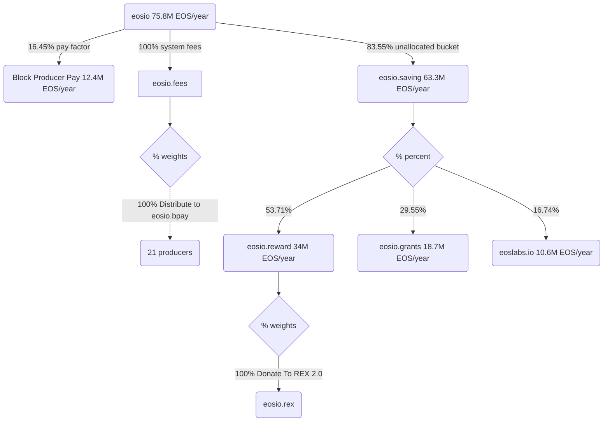

# EOS REX 2.0 Upgrade

> [v3.5.0 Release Notes](https://github.com/eosnetworkfoundation/eos-system-contracts/releases/tag/v3.5.0)

### REX 2.0 distribution flowchart



### Allocations (Annual Rate)

| Sender | Receiver | Allocation (%)| Amount/year |
|--------|-------|------------|--------|
| eosio  |       | 100% | 75,959,037 EOS |
| eosio | eosio.saving | 83.55% | 63,300,000 EOS |
| eosio | producer pay | 16.45% | 12,400,000 EOS |
| eosio.saving | eosio.reward | 53.71% | 34,083,823 EOS |
| eosio.saving | eosio.grants | 29.55% | 18,752,131 EOS |
| eosio.saving | eoslabs.io | 16.74% | 10,623,034 EOS |

## [Build CDT](https://github.com/AntelopeIO/cdt) (`v4.0.1`)

```bash
git clone --recursive https://github.com/AntelopeIO/cdt
cd cdt
git checkout v4.0.1
mkdir build
cd build
cmake ..
make -j $(nproc)
```

## [Compile EOS System Contracts](https://github.com/eosnetworkfoundation/eos-system-contracts/releases/tag/v3.5.0) (`v3.5.0`)

```bash
gh repo clone eosnetworkfoundation/eos-system-contracts
cd eos-system-contracts
git checkout v3.5.0
export CDT_INSTALL_DIR="<path>/cdt/build"
./build.sh
```

## Contract `sha-256` checksums
```bash
$ shasum -a 256 ./build/contracts/**/*.wasm
c586608a9feac6ef51f391d4bf6f4b11178853af351a0953a0d153df48e2fedb  ./build/contracts/eosio.reward/eosio.reward.wasm
b78...???  ./build/contracts/eosio.bpay/eosio.bpay.wasm
0a1...???  ./build/contracts/eosio.system/eosio.system.wasm
```

```bash
$ shasum -a 256 ./build/contracts/**/*.abi
0d7a49cbecce535e1eb4cd308f639a93633e0c0a51d6362643afa0001b9c02d8  ./build/contracts/eosio.reward/eosio.reward.abi
ce9...???  ./build/contracts/eosio.system/eosio.system.abi
696...???  ./build/contracts/eosio.bpay/eosio.bpay.abi
```

### MSIG - EOS REX 2.0

#### Deploy System Contracts

https://github.com/eosnetworkfoundation/eos-system-contracts/releases

- [x] 1.1 Deploy updated `eosio` system contract including REX 2.0
- [x] 1.2 Deploy new `eosio.reward` contract
- [x] 1.3 Deploy new `eosio.bpay` contract
  - [x] 1.3.1 Update permission `eosio.bpay` (15/21) (`eosio` + `@eosio.code`)

#### Configure System Fees & Staking Rewards strategies

- [x] 2.1 Set incoming fees to 100% go to top 21 producers `eosio.bpay` strategy

**eosio.fees::setstrategy**
```json
{
    "strategy": "eosio.bpay",
    "weight": 10000
}
```

- [x] 2.2 Delete previous `donatetorex` strategy from fees

**eosio.fees::delstrategy**
```json
{
    "strategy": "donatetorex"
}
```

- [x] 2.3 Set incoming staking reward allocation to 100% going to REX via `eosio.rex` strategy

**eosio.reward::setstrategy**

```json
{
    "strategy": "eosio.rex",
    "weight": 10000
}
```

#### Configure REX 2.0 features

- [x] 3.1 Set REX maturity to `21 periods` (previously `5 periods`)
- [x] 3.2 Set matured REX is sold immediately to `true`
- [x] 3.3 Set buying REX is moved immediately to REX savings to `true`

**eosio::rexmaturity**
```json
{
    "num_of_maturity_buckets": 21,
    "sell_matured_rex": true,
    "buy_rex_to_savings": true
}
```

#### Set MSIG earliest execution time

- [x] 4. MSIG can only be executed after July 8th 00:00:00 UTC

**time.eosn::checktime**

```json
{
    "time": "2024-07-08T00:00:00.000Z"
}
```